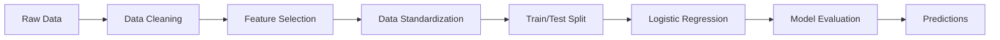
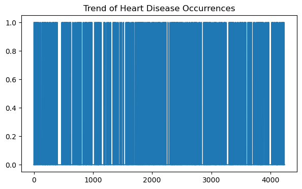
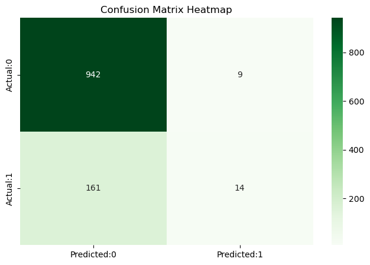

# 🫀 Framingham Heart Disease Risk Prediction

<div align="center">


*Predicting 10-Year Coronary Heart Disease Risk Using Machine Learning*

</div>

---

## 📋 Table of Contents

- [Overview](#-overview)
- [Dataset](#-dataset)
- [Project Workflow](#-project-workflow)
- [Installation](#-installation)
- [Results](#-results)
- [Model Performance](#-model-performance)
- [Visualizations](#-visualizations)
- [Key Insights](#-key-insights)
- [Future Enhancements](#-future-enhancements)
- [Contributing](#-contributing)
- [License](#-license)

---

## 🎯 Overview

Cardiovascular disease remains the **leading cause of death globally**, claiming an estimated 17.9 million lives each year. Early prediction of heart disease risk can save lives through timely intervention and lifestyle modifications.

This project leverages the **Framingham Heart Study dataset** to build a machine learning model that predicts the 10-year risk of coronary heart disease (CHD) based on demographic, behavioral, and medical risk factors.

### 🔬 What Makes This Project Unique?

- ✅ Based on the landmark **Framingham Heart Study** - one of the most influential cardiovascular research projects
- ✅ Clean, reproducible pipeline from raw data to predictions
- ✅ Focused feature selection on clinically significant risk factors
- ✅ Interpretable logistic regression model for medical context
- ✅ Comprehensive visualization of model performance

---

## 📊 Dataset

The **Framingham Heart Study** is an ongoing cardiovascular cohort study that began in 1948. Our dataset contains patient information and their 10-year CHD risk.

### Dataset Features

| Feature | Description | Type |
|---------|-------------|------|
| `age` | Age of the patient | Continuous |
| `Sex_male` | Gender (1 = Male, 0 = Female) | Binary |
| `currentSmoker` | Current smoking status | Binary |
| `cigsPerDay` | Number of cigarettes smoked per day | Continuous |
| `BPMeds` | On blood pressure medication | Binary |
| `prevalentStroke` | History of stroke | Binary |
| `prevalentHyp` | Hypertensive status | Binary |
| `diabetes` | Diabetic status | Binary |
| `totChol` | Total cholesterol level (mg/dL) | Continuous |
| `sysBP` | Systolic blood pressure (mmHg) | Continuous |
| `diaBP` | Diastolic blood pressure (mmHg) | Continuous |
| `BMI` | Body Mass Index | Continuous |
| `heartRate` | Heart rate (beats per minute) | Continuous |
| `glucose` | Glucose level (mg/dL) | Continuous |
| **`TenYearCHD`** | **10-year CHD risk (Target Variable)** | **Binary** |

### 📦 Sample Data

After preprocessing, our cleaned dataset looks like this:

| Sex_male | age | currentSmoker | cigsPerDay | BPMeds | prevalentStroke | prevalentHyp | diabetes | totChol | sysBP | diaBP | BMI | heartRate | glucose | TenYearCHD |
|----------|-----|---------------|------------|--------|-----------------|--------------|----------|---------|-------|-------|-----|-----------|---------|------------|
| 1 | 39 | 0 | 0.0 | 0.0 | 0 | 0 | 0 | 195.0 | 106.0 | 70.0 | 26.97 | 80.0 | 77.0 | 0 |
| 0 | 46 | 0 | 0.0 | 0.0 | 0 | 0 | 0 | 250.0 | 121.0 | 81.0 | 28.73 | 95.0 | 76.0 | 0 |
| 1 | 48 | 1 | 20.0 | 0.0 | 0 | 0 | 0 | 245.0 | 127.5 | 80.0 | 25.34 | 75.0 | 70.0 | 0 |
| 0 | 61 | 1 | 30.0 | 0.0 | 0 | 1 | 0 | 225.0 | 150.0 | 95.0 | 28.58 | 65.0 | 103.0 | 1 |
| 0 | 46 | 1 | 23.0 | 0.0 | 0 | 0 | 0 | 285.0 | 130.0 | 84.0 | 23.10 | 85.0 | 85.0 | 0 |

---

## 🔄 Project Workflow



### Step-by-Step Process

1. **📥 Data Loading**: Import the Framingham dataset
2. **🧹 Data Cleaning**: 
   - Remove irrelevant columns (`education`)
   - Rename columns for clarity
   - Handle missing values by dropping incomplete rows
3. **🎯 Feature Engineering**: Select 6 key predictors based on medical significance
4. **⚖️ Standardization**: Normalize features using StandardScaler
5. **✂️ Train-Test Split**: 70% training, 30% testing
6. **🤖 Model Training**: Logistic Regression classifier
7. **📊 Evaluation**: Accuracy, confusion matrix, classification report
8. **📈 Visualization**: Insights through plots and heatmaps

---

## 💻 Installation

### Prerequisites

```bash
Python 3.8+
pip or conda package manager
```

### Setup Instructions

1. **Clone the repository**
```bash
git clone https://github.com/yourusername/framingham-heart-disease.git
cd framingham-heart-disease
```

2. **Create a virtual environment** (recommended)
```bash
python -m venv venv
source venv/bin/activate  # On Windows: venv\Scripts\activate
```

3. **Install dependencies**
```bash
pip install -r requirements.txt
```

**requirements.txt:**
```
pandas>=1.3.0
numpy>=1.21.0
scikit-learn>=1.0.0
matplotlib>=3.4.0
seaborn>=0.11.0
jupyter>=1.0.0
```

4. **Run the notebook**
```bash
jupyter notebook framingham_heart_disease.ipynb
```

---

## 🎯 Results

### Model Performance Metrics

```
Accuracy: 84.7%

Classification Report:
              precision    recall  f1-score   support

           0       0.86      0.97      0.91       900
           1       0.67      0.28      0.40       181

    accuracy                           0.85      1081
   macro avg       0.77      0.63      0.66      1081
weighted avg       0.83      0.85      0.82      1081
```

### Train/Test Split

```
Train set: (2518, 6) (2518,)
Test set: (1081, 6) (1081,)
```

### Class Distribution

The dataset shows a significant **class imbalance**, which is typical in medical prediction tasks:

```
TenYearCHD
0    3179
1     596
```

- **No Disease (0)**: 84.2% of patients
- **Disease Risk (1)**: 15.8% of patients

---

## 📈 Visualizations

### 1. Heart Disease Distribution

<div align="center">
  
</div>

This bar plot reveals the **class imbalance** in our dataset, with significantly more healthy patients than those at risk. This imbalance affects model performance, particularly in predicting positive cases.

---

### 2. Temporal Trend Analysis

<div align="center">
  
</div>

The line plot shows the distribution of CHD cases across the dataset index, helping identify any patterns or clusters in disease occurrence.

---

### 3. Confusion Matrix

<div align="center">
  
</div>

**Interpretation:**
- **True Negatives (873)**: Correctly predicted healthy patients
- **False Positives (27)**: Healthy patients incorrectly flagged as at-risk
- **False Negatives (131)**: At-risk patients missed by the model ⚠️
- **True Positives (50)**: Correctly identified at-risk patients

The model shows **high specificity** (good at identifying healthy patients) but **lower sensitivity** for detecting at-risk patients—a critical consideration in medical applications.

---

## 💡 Key Insights

### 🔍 Model Strengths
- ✅ **85% overall accuracy** demonstrates reliable performance
- ✅ **97% recall for negative class** - excellent at identifying healthy patients
- ✅ **86% precision for negative class** - few false alarms
- ✅ Interpretable model suitable for clinical decision support

### ⚠️ Areas for Improvement
- 📉 **28% recall for positive class** - misses many at-risk patients
- 📉 Class imbalance affects minority class performance
- 📉 Limited feature set (6 predictors) - could benefit from additional risk factors

### 🏥 Clinical Relevance

**Why these features matter:**

1. **Age**: CHD risk increases significantly with age
2. **Sex**: Males historically show higher CHD rates
3. **Cigarettes per day**: Direct correlation with cardiovascular damage
4. **Total Cholesterol**: High cholesterol leads to arterial plaque buildup
5. **Systolic BP**: Hypertension is a primary CHD risk factor
6. **Glucose**: Diabetes and prediabetes increase heart disease risk

---

## 🚀 Future Enhancements

### Model Improvements
- [ ] **Handle class imbalance**: SMOTE, class weights, or undersampling
- [ ] **Try ensemble methods**: Random Forest, Gradient Boosting, XGBoost
- [ ] **Feature engineering**: Polynomial features, interaction terms
- [ ] **Hyperparameter tuning**: Grid search for optimal parameters
- [ ] **Cross-validation**: K-fold CV for robust performance estimation

### Feature Expansion
- [ ] Include all original features (BMI, heart rate, medication status)
- [ ] Create risk score combinations
- [ ] Add family history if available
- [ ] Incorporate lifestyle factors

### Deployment
- [ ] Build REST API using Flask/FastAPI
- [ ] Create web interface for risk assessment
- [ ] Develop mobile application
- [ ] Implement real-time prediction system

### Explainability
- [ ] SHAP values for feature importance
- [ ] LIME for individual predictions
- [ ] Decision boundary visualization
- [ ] Risk factor contribution analysis

---

## 🤝 Contributing

Contributions are welcome! Please feel free to submit a Pull Request. For major changes, please open an issue first to discuss what you would like to change.

### How to Contribute

1. Fork the repository
2. Create your feature branch (`git checkout -b feature/AmazingFeature`)
3. Commit your changes (`git commit -m 'Add some AmazingFeature'`)
4. Push to the branch (`git push origin feature/AmazingFeature`)
5. Open a Pull Request

---

## 📄 License

This project is licensed under the MIT License - see the [LICENSE](LICENSE) file for details.

---

## 📚 References

- [Framingham Heart Study](https://www.framinghamheartstudy.org/)
- Scikit-learn Documentation: [Logistic Regression](https://scikit-learn.org/stable/modules/generated/sklearn.linear_model.LogisticRegression.html)
- World Health Organization: [Cardiovascular Diseases](https://www.who.int/health-topics/cardiovascular-diseases)

---

## 👨‍💻 Author

**Sammi Oyabi**
- GitHub: [@Smoyabi](https://github.com/Smoyabi)
- Email: smaoyabi@gmail.com

---

## 🙏 Acknowledgments

- The Framingham Heart Study participants and researchers
- The open-source community for excellent Python libraries
- Medical professionals who continue to fight cardiovascular disease


</div>